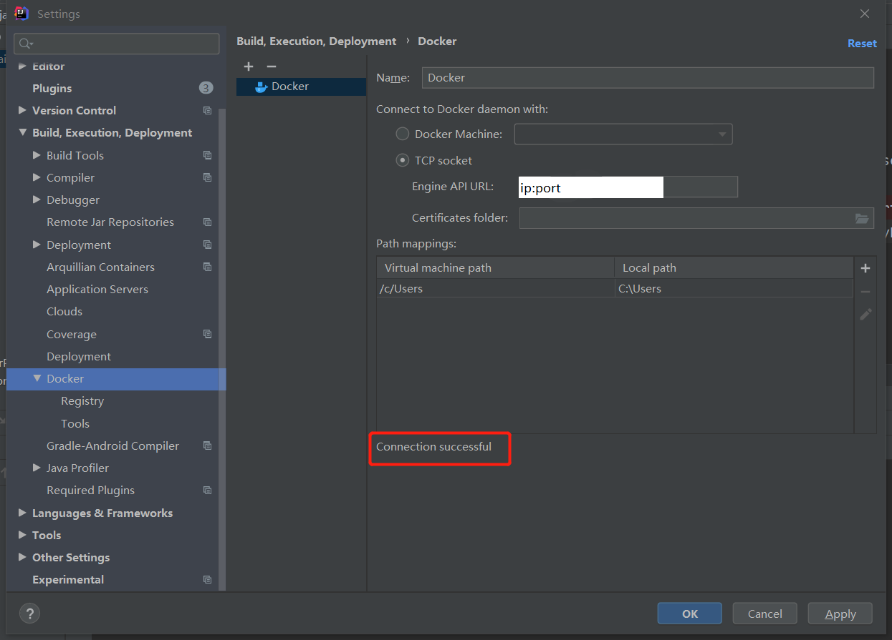
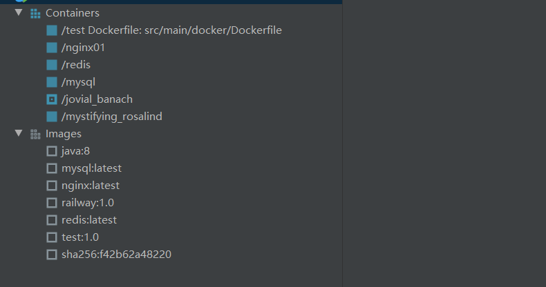
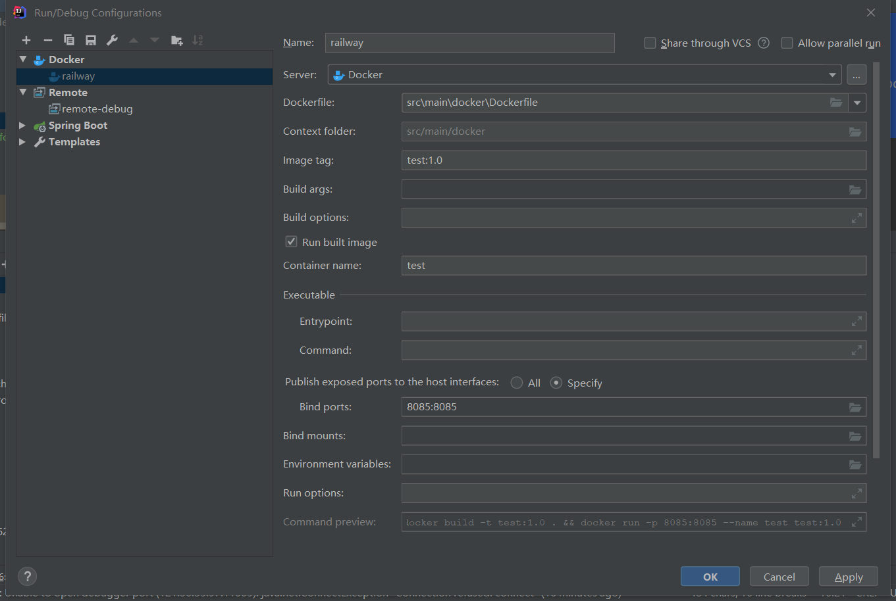
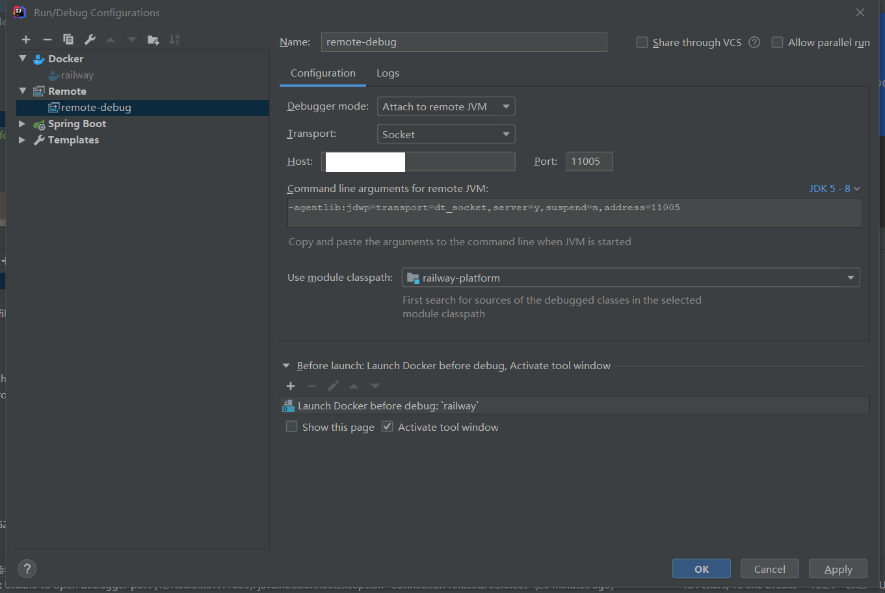
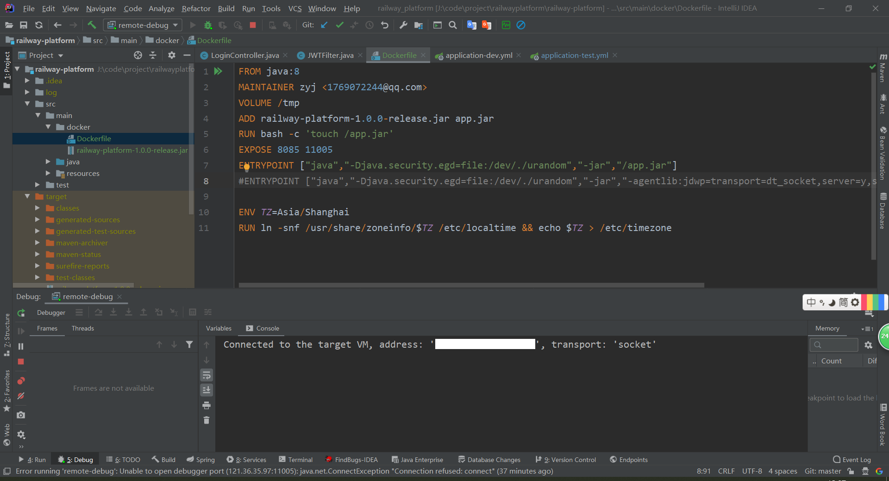

# 部署
## 配置docker的远程端口

```shell
# 修改docker.service支持远程访问
vim /usr/lib/systemd/system/docker.service
# ExecStart=/usr/bin/dockerd -H fd:// --containerd=/run/containerd/containerd.sock
ExecStart=/usr/bin/dockerd -H tcp://0.0.0.0:9527 -H unix:///var/run/docker.sock
# 通知docker服务做出的修改
systemctl daemon-reload
# 重启docker
systemctl restart docker
```

<!--more-->

## IDEA连接远程服务器Docker

idea，settings搜索docker,没有请先安装docker插件。



显示docker images及container



## 远程部署服务

在src/main下新建docker文件夹，新建Dockerfile文件

```dockerfile
FROM java:8
MAINTAINER zyj <1769072244@qq.com>
VOLUME /tmp
ADD railway-platform-1.0.0-release.jar app.jar
RUN bash -c 'touch /app.jar'
EXPOSE 8085 11005
ENTRYPOINT ["java","-Djava.security.egd=file:/dev/./urandom","-jar","/app.jar"]
#ENTRYPOINT ["java","-Djava.security.egd=file:/dev/./urandom","-jar","-agentlib:jdwp=transport=dt_socket,server=y,suspend=n,address=11005","/app.jar"]

ENV TZ=Asia/Shanghai
RUN ln -snf /usr/share/zoneinfo/$TZ /etc/localtime && echo $TZ > /etc/timezone
```

maven打包，将jar包放置在src/main/docker文件夹内,配置dockerfile启动，Dockerfile选择新建的Dockerfile文件。



最后运行docker，会构建镜像及启动容器。

# 远程调试



添加Remote，host填写服务器ip，port填写监听端口，复制

``-agentlib:jdwp=transport=dt_socket,server=y,suspend=n,address=11005``

到Dockerfile文件中

```dockerfile
FROM java:8
MAINTAINER zyj <1769072244@qq.com>
VOLUME /tmp
ADD railway-platform-1.0.0-release.jar app.jar
RUN bash -c 'touch /app.jar'
EXPOSE 8085 11005
ENTRYPOINT ["java","-Djava.security.egd=file:/dev/./urandom","-jar","-agentlib:jdwp=transport=dt_socket,server=y,suspend=n,address=11005","/app.jar"]

ENV TZ=Asia/Shanghai
RUN ln -snf /usr/share/zoneinfo/$TZ /etc/localtime && echo $TZ > /etc/timezone
```

点击下方+号，添加Dockerfile文件。debug启动，结束。



# webstorm远程部署vue

和idea操作基本一致，在根目录新建nginx.conf

```
#user  nobody;
worker_processes  1;

#error_log  logs/error.log;
#error_log  logs/error.log  notice;
#error_log  logs/error.log  info;

#pid        logs/nginx.pid;


events {
    worker_connections  1024;
}


http {
    include       mime.types;
    default_type  application/octet-stream;

    #log_format  main  '$remote_addr - $remote_user [$time_local] "$request" '
    #                  '$status $body_bytes_sent "$http_referer" '
    #                  '"$http_user_agent" "$http_x_forwarded_for"';

    #access_log  logs/access.log  main;

    sendfile        on;
    #tcp_nopush     on;

    #keepalive_timeout  0;
    keepalive_timeout  65;

    #gzip  on;

    server {
        listen       80;
        server_name  localhost;

        #charset koi8-r;

        #access_log  logs/host.access.log  main;

        location / {
            root   /usr/share/nginx/html;
            index  index.html index.htm;
        }

        #error_page  404              /404.html;

        # redirect server error pages to the static page /50x.html
        #
        error_page   500 502 503 504  /50x.html;
        location = /50x.html {
            root   html;
        }

        # proxy the PHP scripts to Apache listening on 127.0.0.1:80
        #
        #location ~ \.php$ {
        #    proxy_pass   http://127.0.0.1;
        #}

        # pass the PHP scripts to FastCGI server listening on 127.0.0.1:9000
        #
        #location ~ \.php$ {
        #    root           html;
        #    fastcgi_pass   127.0.0.1:9000;
        #    fastcgi_index  index.php;
        #    fastcgi_param  SCRIPT_FILENAME  /scripts$fastcgi_script_name;
        #    include        fastcgi_params;
        #}

        # deny access to .htaccess files, if Apache's document root
        # concurs with nginx's one
        #
        #location ~ /\.ht {
        #    deny  all;
        #}
    }


    # another virtual host using mix of IP-, name-, and port-based configuration
    #
    #server {
    #    listen       8000;
    #    listen       somename:8080;
    #    server_name  somename  alias  another.alias;

    #    location / {
    #        root   /usr/share/nginx/html;
    #        index  index.html index.htm;
    #    }
    #}


    # HTTPS server
    #
    #server {
    #    listen       443 ssl;
    #    server_name  localhost;

    #    ssl_certificate      cert.pem;
    #    ssl_certificate_key  cert.key;

    #    ssl_session_cache    shared:SSL:1m;
    #    ssl_session_timeout  5m;

    #    ssl_ciphers  HIGH:!aNULL:!MD5;
    #    ssl_prefer_server_ciphers  on;

    #    location / {
    #        root   html;
    #        index  index.html index.htm;
    #    }
    #}

}
```

Dockerfile

```dockerfile
FROM nginx
MAINTAINER zyj <1769072244@qq.com>
COPY dist/  /usr/share/nginx/html/
COPY nginx.conf /etc/nginx/nginx.conf
```

build打包，然后docker部署。